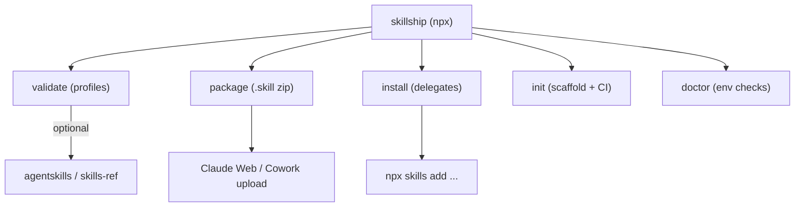

# skillship — Build Brief

> This is a self-contained specification. A fresh agent session with no prior
> context should be able to scaffold the `skillship` project from this file
> alone. Build it as a **new standalone repository**,

## 1. Purpose and non-goals

`skillship` is a small Node/TypeScript CLI that makes any
[Agent Skill](https://agentskills.io/specification) (a `SKILL.md` directory)
portable across **Cursor**, **Claude Code**, **Claude Web**, and **Claude
Cowork**.

It exists to fill the gaps that the existing ecosystem leaves open:

- `npx skills` (vercel-labs, ~22k stars, `skills.sh`) already solves *filesystem
  install* across 70+ agents. `skillship` MUST delegate to it, not reimplement
  it.
- `skills-ref` / `agentskills` (Python) is the official spec validator but is
  explicitly "for demonstration only, not production," and only checks the spec
  limit (1024-char description). It does NOT enforce the stricter Claude
  upload limit (200 chars), `.skill` packaging, or release automation.

So `skillship` is a **thin orchestration layer** that adds:

1. Strict, per-surface **validation profiles** (notably the 200-char upload
   cap).
2. **`.skill` packaging** for Claude Web / Cowork uploads.
3. **`init` scaffolding** with reusable release-please CI and commit
   conventions.

Non-goals (do NOT build these):

- Do not reimplement the multi-agent install matrix; shell out to `npx skills`.
- Do not host a skill registry; that is `skills.sh`.
- Do not implement Claude API `/v1/skills` uploads.

## 2. Runtime and distribution

- Language: **TypeScript**, compiled to Node (ESM, Node >= 18).
- Distribution: published to npm as **`skillship`**; primary usage `npx
  skillship <cmd>`.
- Single binary named `skillship` (via `package.json` `bin`).

Name note: `skillkit` was already taken on npm by an active competitor;
`skillship` is the chosen free, on-theme name (package and ship skills
everywhere). Publish both package and bin as `skillship`.



## 3. CLI surface

```
skillship validate <dir>    [--profile <p>] [--json]
skillship package  <dir>    [--out <dir>]
skillship install  [source] [--agent <a,b>] [--global] [--copy]
skillship init     [name]   [--ci] [--snippets] [--new-dir]
skillship doctor
```

- `<dir>` defaults to `.`. `validate` and `package` discover skills under it: a
  lone `SKILL.md`, a bare name under `skills/`, else every skill under
  `skills/`. `validate` checks each; `package` bundles them.
- `install`'s `[source]` is a local path (default `.`) **or** a remote ref
  (`owner/repo`, `owner/repo@skill-name`, a GitHub/GitLab URL, or any git URL);
  remote refs are `git clone --depth 1`'d to a temp dir, installed, then
  removed.
- `init` scaffolds into the current directory by default; `--new-dir` creates a
  new `<name>/` project directory instead.
- `--profile`: one of `spec | claude-web | claude-cowork | cursor | all`
(default `all`, the strictest combination).
- `--json`: machine-readable output for CI.
- Exit non-zero on any validation failure.

## 4. Validation profiles

Parse the `SKILL.md` YAML frontmatter (`name`, `description`, optional
`license`,
`metadata`, `allowed-tools`) and the markdown body. Apply checks per profile:

| Check | spec | cursor | claude-web | claude-cowork |
| --- | --- | --- | --- | --- |
| `name` present, lowercase/numbers/hyphens, no leading/trailing/`--`, optional `:`-namespacing (e.g. `skillship:author`) | yes | yes | yes | yes |
| `name` matches parent folder | yes | yes | yes | yes |
| `description` non-empty, no `<`/`>` (XML) | yes | yes | yes | yes |
| `description` length | <= 1024 | <= 1024 | **<= 200** | **<= 200** |
| Body recommended <= 500 lines | warn | warn | warn | warn |
| Packaged zip root is `<name>/SKILL.md` | n/a | n/a | yes | yes |

- `--profile all` runs every check; description must satisfy the **200-char**
  minimum-common-denominator to pass.
- Frontmatter parser MUST handle YAML block scalars (`>`, `>-`, `>+`, `|`, `|-`,
  `|+`) and nested maps (e.g. `metadata:` with indented children) without
mis-joining. (This was a real bug in the origin `validate.py` — handle it.)
- If `agentskills` (Python) is available on PATH, optionally run
  `agentskills validate <dir>` and merge its findings; never hard-depend on it.

## 5. Packaging contract

`skillship package [dir]` (default `dir` = `.`):

1. Discover the skills to bundle: if `<dir>/SKILL.md` exists it is a single
   skill; else bundle every immediate subdir of `<dir>/skills/` (or of `<dir>`)
   that contains a `SKILL.md`.
2. Run `validate --profile all` on every discovered skill first; abort if any
   fails.
3. Produce a single `<out>/<name>.skill` (default `<out>` = `dist/`), a zip
   where each skill lives under its own `<skill-name>/` folder at the root —
   i.e. entries are `<skill-name>/SKILL.md`, `<skill-name>/...`. Claude upload
   rejects archives with files at the zip root.
4. The bundle `<name>` is the lone skill's name, or for multiple skills their
   longest common prefix trimmed of a trailing `-`/`:` (e.g. `skillship`,
   `skillship:author`, `skillship:install` → `skillship`), falling back to the
   project folder name.
5. `:` is rewritten to `-` in zip folder names and the output filename, since
   `:` is illegal in filenames on Windows (and archivers treat a leading
   `prefix:` as a drive). So `skillship:author` is stored as
   `skillship-author/`.
6. Exclude `__pycache__/`, `.DS_Store`, `node_modules/`, `dist/`, `.git/`.
7. The `.skill` file is a normal zip with a renamed extension.

Use `archiver` (or `yazl`) for deterministic zip creation. Add a test that
unzips the output and asserts every entry sits under a `<skill-name>/` segment.

## 6. Install behavior

`skillship install [source]`:

- `source` may be a local directory or a remote ref. Remote refs (`owner/repo`,
  `owner/repo@skill-name`, GitHub/GitLab URLs, or any git URL) are cloned
  shallow
  to a temp directory, installed from there, then cleaned up. `git` must be on
  PATH.
- Remote skill resolution: a tree-URL subpath or `@skill-name` filter wins;
  otherwise `skills/<repoName>/` is tried, then a lone skill under `skills/`. A
  repo with multiple skills under `skills/` requires `@skill-name` or a subpath
  to disambiguate.
- For filesystem agents (Cursor, Claude Code, etc.), shell out to the ecosystem
  tool rather than copying by hand:
  ```
  npx skills add <dir> [--global] [--copy] -a <agent...>
  ```
Default agents when `-a` omitted: -a `cursor` -a `claude-code`. Map `--global` to
`npx skills` global flag and `--copy` to its copy flag.
- When installing for `cursor`, also deploy the skill's Cursor extras if
  present:
  copy `cursor/rules/*.mdc` into `~/.cursor/rules/` (global) or `.cursor/rules/`
  (project), and merge `cursor/hooks.json` entries (by event key + `command`)
  into the corresponding `hooks.json`.
- For upload-only surfaces (Claude Web, Claude Cowork), there is no filesystem
  install. Print clear instructions instead:
  - "Run `skillship package <dir>` then upload `dist/<name>.skill`."
  - Claude Web: Settings -> Capabilities -> Upload skill -> enable toggle.
  - Claude Cowork: Customize -> Skills -> Upload (desktop app only).
- If `npx`/`skills` is unavailable, fail with a helpful message (see `doctor`).

## 7. CI templates (emitted by `init --ci`)

`init` scaffolds a skill repo that auto-releases via
[release-please](https://github.com/googleapis/release-please-action) using
[Conventional Commits](https://www.conventionalcommits.org/). Emit these files,
parameterized by skill `name`:

- `release-please-config.json` — manifest config, `release-type: simple`,
  changelog sections (`feat`/`fix`/`perf`/`docs`/`refactor`; `ci`/`chore`
  hidden), and an `extra-files` `generic` updater targeting
  `skills/<name>/SKILL.md`.
- `.release-please-manifest.json` — `{ ".": "1.0.0" }`.
- `version.txt` — `1.0.0`.
- `.github/workflows/validate.yml` — on `pull_request` + `push`, runs
  `npx skillship validate <name>` (resolves `skills/<name>/` by convention).
- `.github/workflows/release.yml` — on `push` to `main`: run
  `googleapis/release-please-action@v4`; then, gated on
  `steps.release.outputs.release_created`, check out, `npx skillship package
  <name>`, and `gh release upload "<tag>" dist/<name>.skill --clobber`.
Needs `permissions: contents: write, pull-requests: write`.

`SKILL.md` version marker convention: the version line carries an inline
comment so release-please updates it in place and the validator ignores it:

```yaml
metadata:
  version: "1.0.0" # x-release-please-version
```

Document that the repo must enable Settings -> Actions -> Workflow permissions:
"Read and write" + "Allow GitHub Actions to create and approve pull requests".

## 8. Repo layouts

A consumer skill repo scaffolded by `init`:

```
my-skill/
  skills/my-skill/SKILL.md
  cursor/                   # if --snippets
    rules/my-skill.mdc      # Cursor trigger rule (auto-installed by install -a cursor)
    hooks.json              # Cursor hooks merged into ~/.cursor/hooks.json on install
  release-please-config.json
  .release-please-manifest.json
  version.txt
  .github/workflows/{validate,release}.yml
  AGENTS.md
  README.md
```

The `skillship` project itself:

```
skillship/
  package.json              # bin: { "skillship": "dist/cli.js" }, type: module
  tsconfig.json
  src/
    cli.ts                  # arg parsing, command dispatch
    commands/{validate,package,install,init,doctor}.ts
    lib/frontmatter.ts      # YAML frontmatter parser (block scalars + maps)
    lib/profiles.ts         # profile definitions and checks
    lib/zip.ts              # .skill packaging
    lib/exec.ts             # spawn wrapper for `npx skills`, `gh`, `agentskills`
    lib/load.ts             # SKILL.md loader
    lib/remote.ts           # remote ref detection + git clone resolution
  templates/                # CI + snippet + AGENTS/README/SKILL templates for `init`
    release-please-config.json
    release.yml
    validate.yml
    cursor-rule.mdc
    cursor-hooks.json
    AGENTS.md
    README.md
    SKILL.md
  skills/skillship/         # bundled Agent Skill (the /skillship skill)
    SKILL.md
  test/
    fixtures/
    *.test.ts
  README.md
```

## 9. Project setup

- `package.json`: `"type": "module"`, `"bin": { "skillship": "dist/cli.js" }`,
  `"engines": { "node": ">=18" }`, scripts for `build`, `test`, `lint`.
- Build with `tsup` (or `tsc`) to `dist/`.
- Arg parsing: `commander`.
- Zip: `archiver`.
- Tests: `vitest`.
- Keep runtime deps minimal; everything heavy (`npx skills`, `gh`,
  `agentskills`) is invoked as a subprocess, not bundled.

## 10. Testing

Provide `test/fixtures/`:

- `valid-skill/` — passes `--profile all`.
- `long-description/` — description > 200 chars: fails
  `claude-web`/`claude-cowork`
  and `all`, passes `spec`.
- `name-mismatch/` — `name` != folder: fails every profile.
- `block-scalar/` — uses `description: >-` and nested `metadata:` to prove the
  parser handles both.

Required tests:

- Each fixture yields the expected pass/fail set per profile.
- `package` output unzips with `<name>/SKILL.md` at the root and excludes junk.
- `install` builds the correct `npx skills add ...` argv (mock `exec`).
- `init` writes all expected files with the skill name substituted.

## 11. Acceptance criteria

- `npx skillship validate ./my-skill --profile all` exits 0 for a valid skill,
  non-zero with clear messages otherwise.
- `npx skillship package ./my-skill` yields `dist/my-skill.skill` that uploads
  cleanly to Claude Web and Cowork.
- `npx skillship install ./my-skill -a cursor -a claude-code` installs via
  `npx skills`.
- `npx skillship init demo --ci --snippets` scaffolds a repo whose CI, on a
  merged release PR, publishes `demo.skill` to a GitHub Release.

## 12. Out of scope

- Skill registry/discovery hosting (use `skills.sh`).
- Reimplementing `npx skills` install internals.
- Claude API `/v1/skills` programmatic upload.
